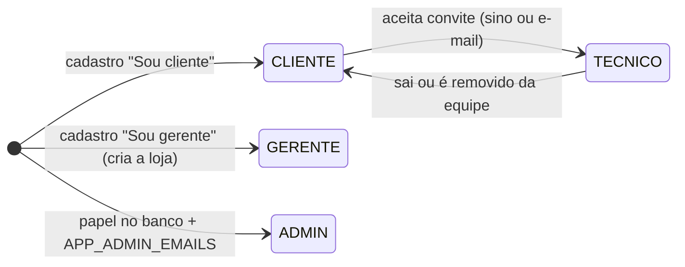

# Papéis e lojas

> Como cada papel nasce e muda. Base: RF12 (SYN-17) + isolamento por loja (SYN-100/101/102).

## Fluxo de papéis

- **Cliente:** vê só os próprios pedidos, de qualquer loja. Não pertence a loja nenhuma.
- **Gerente:** dono da loja. Convida clientes pelo e-mail exato, cuida da equipe e dos orçamentos.
- **Técnico:** funcionário da loja. Trabalha nos dados dela (pedidos, cores, estoque, agenda).
- **Admin:** fora das lojas. Pelo painel `/admin` vê e edita usuários e pedidos de todas.

Cada loja só enxerga os próprios dados, e a loja vem sempre do usuário logado. Registro de outra
loja responde como não encontrado.
