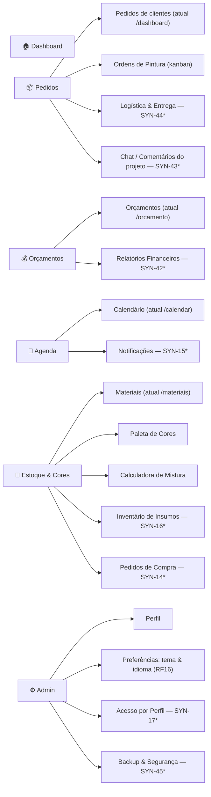

# SYN-53 — Mapa do novo menu (5 áreas)

> Proposta de navegação para **validação com os professores**. Nenhum código alterado.
> Taxonomia definida na issue: **Dashboard** (home) + 5 áreas — **Pedidos, Orçamentos, Agenda,
> Estoque & Cores, Admin**.
> Data: 2026-08-24 · Épico: SYN-48 (RF16 — Personalizar Interface)

---

## 1. Situação atual

A Sidebar tem **8 itens planos**, sem agrupamento, e mistura níveis diferentes (uma ferramenta
como "Calculadora de Mistura" tem o mesmo peso visual que "Pedidos"):

Pedidos · Paleta de Cores · Calculadora de Mistura · Materiais · Orçamento · Ordens de Pintura · Calendário · Perfil

Problemas: sem hierarquia, itens correlatos separados (Paleta ↔ Calculadora ↔ Materiais),
e **não há onde encaixar** as funcionalidades das próximas sprints (relatórios, chat, logística,
inventário, notificações) sem a lista virar 13+ itens planos.

## 2. Proposta — Dashboard + 5 áreas

\* = funcionalidade futura das Sprints 1/2 do TCC 2 — a área já nasce com o "slot" reservado.

### Detalhe por área

| Área | Conteúdo hoje | Chega nas próximas sprints | Racional |
|---|---|---|---|
| **Dashboard** (home) | — (hoje `/dashboard` é a lista de pedidos) | Visão geral: pedidos em andamento, próximos eventos, alertas de estoque; futuro dashboard **customizável** | Hoje o app "abre numa lista"; um hub dá visão do negócio e é o destino natural pós-login |
| **Pedidos** | Pedidos de clientes, Ordens de Pintura | Logística & Entrega (SYN-44), Chat/Comentários (SYN-43) | Tudo que acompanha o ciclo de vida de um pedido, do aceite à entrega |
| **Orçamentos** | Orçamento | Relatórios Financeiros (SYN-42) | Dinheiro num lugar só: precificar antes, medir resultado depois |
| **Agenda** | Calendário | Notificações (SYN-15) | Tempo e avisos: o que vai acontecer e o que precisa de atenção |
| **Estoque & Cores** | Materiais, Paleta de Cores, Calculadora de Mistura | Inventário de Insumos (SYN-16), Pedidos de Compra (SYN-14) | Insumos físicos e o ferramental de cor que os consome — hoje espalhados em 3 itens soltos |
| **Admin** | Perfil | Preferências de tema/idioma (RF16), Acesso por Perfil (SYN-17), Backup & Segurança (SYN-45) | Conta, permissões e configurações — separado da operação do dia a dia |

### Mapeamento de rotas (sem quebrar links)

| Rota atual | Destino no novo menu | Ação |
|---|---|---|
| `/dashboard` | Pedidos → Pedidos de clientes | Renomear conceito; redirect da rota antiga |
| `/ordens-pintura` | Pedidos → Ordens de Pintura | Mantém |
| `/orcamento` | Orçamentos | Mantém |
| `/calendar` | Agenda → Calendário | Mantém |
| `/materiais` | Estoque & Cores → Materiais | Mantém |
| `/paleta-cores` | Estoque & Cores → Paleta de Cores | Mantém |
| `/calculadora-mistura` | Estoque & Cores → Calculadora | Mantém |
| `/perfil` | Admin → Perfil | Mantém |
| *(nova)* `/home` ou `/` autenticado | Dashboard | Criar |

### Comportamento do menu (proposta de UI)

- Sidebar com **grupos expansíveis**: título da área + subitens; área ativa expandida, demais
  colapsadas. Estado de expansão persistido (mesmo padrão do `sf-theme`).
- Toggle de tema e "Sair" permanecem no rodapé da Sidebar; seletor de idioma migra para
  Admin → Preferências (o PT|EN do Login continua).
- Rotas antigas mantidas com redirect → nada de link quebrado em favoritos/histórico.

## 3. Perguntas para validação com os orientadores

1. O **Dashboard-home** entra já como página simples (cartões de resumo) ou só quando o
   dashboard customizável for implementado?
2. "Ordens de Pintura" sob **Pedidos** ou sob **Estoque & Cores**? (proposta: Pedidos, pois cada
   ordem pertence a um pedido — mas o pintor talvez pense "cores" primeiro.)
3. **Admin** visível para todo usuário (só Perfil/Preferências) e itens administrativos
   aparecendo conforme o papel (SYN-17), ou área inteira restrita a gestores?
4. Nomenclatura: "Estoque & Cores" está bom, ou separar em duas áreas quebraria o limite de 5?

## 4. Próximos passos (após validação)

1. Ajustar este mapa com o feedback dos professores.
2. Issue de implementação: refatorar `NAV_ITEMS` da Sidebar para grupos + redirects de rota.
3. Issue do Dashboard-home (escopo conforme resposta da pergunta 1).
